# HomeLab Dockerized GitOps Deployment

This repository implements a **GitOps-based infrastructure management system** for Dockerized services in HomeLab environments. Each orphan branch contains self-contained service configurations, enabling isolated deployments with automatic synchronization through [Komodo](https://komo.do/docs/intro) automation. Designed for reproducibility, scalability, and version-controlled infrastructure as code.

### Key Benefits

- **Version-controlled infrastructure**: Every change is tracked and auditable
- **Self-healing capabilities**: Automatic reconciliation of configuration drift
- **Modular architecture**: Service isolation via branch-per-environment model
- **Rollback readiness**: Instant revert to any working state

---

## 📚 Table of Contents

1. [Requirements](#requirements)
2. [Repository Structure](#repository-structure)
3. [Branching Workflow](#branching-workflow)
4. [Working Process](#working-process)
5. [Security & Best Practices](#security--best-practices)
6. [FAQ/Troubleshooting](#faqtroubleshooting)
7. [Advanced Architecture](#advanced-architecture)

---

## Requirements

### Core Dependencies

| Tool                                                                 | Version | Purpose               | Docs                                             |
| -------------------------------------------------------------------- | ------- | --------------------- | ------------------------------------------------ |
| [Docker](https://docs.docker.com/engine/install/ubuntu/)             | 24.x    | Container runtime     | [Docker Docs](https://docs.docker.com/)          |
| [Docker Compose](https://docs.docker.com/compose/install/linux/)     | v2.23   | Service orchestration | [Compose Docs](https://docs.docker.com/compose/) |
| [Git](https://git-scm.com/book/en/v2/Getting-Started-Installing-Git) | 2.35+   | Version control       | [Git Docs](https://git-scm.com/docs)             |
| [Komodo](https://komo.do/docs/cli)                                   | 1.8+    | GitOps automation     | [Komodo Docs](https://komo.do/docs/intro)        |

> All instructions assume **Ubuntu 22.04 LTS**

---

## Repository Structure


### Directory Breakdown

This repository uses **orphan branches** to manage each service independently. The `main` branch serves only as a landing page and reference index.

#### `main` (Root branch)

- Contains only `README.md`
- Each service exists in its own orphan branch with the same name

#### `<Service>/` (Orphan branch)

Each orphan branch (named after the service) contains:

- `compose.yml`: Docker Compose configuration
- `.env`: Optional environment variables
- `setup.sh`: Optional initialization or bootstrap script
- `README.md`: Service-specific documentation and usage notes

> ✅ Orphan branches ensure clean, focused, and version-controlled deployments — each service is fully self-contained.

##### Example `compose.yml`

```yaml
---
services:
  plex:
    image: lscr.io/linuxserver/plex
    container_name: plex
    network_mode: host
    environment:
      - PUID=1000
      - PGID=1000
      - TZ=Etc/UTC
      - VERSION=docker
      - PLEX_CLAIM= #optional
    volumes:
      - /path/to/plex/library:/config
      - /path/to/tvseries:/tv
      - /path/to/movies:/movies
    restart: unless-stopped
```

---

## Branching Workflow

```mermaid
graph LR
    main["main (README only)"] --> Nginx
    main --> Nextcloud
    main --> Jellyfin

    Nginx --> N1["compose.yml → Nginx Container"]
    Nextcloud --> N2["compose.yml → Nextcloud Container"]
    Jellyfin --> N3["compose.yml → Jellyfin Container"]
```



### GitOps Branch Lifecycle


### Creating a New Service Branch

```bash
# Create orphan branch
git checkout --orphan plex
git reset

# Add service config
touch compose.yml

# Commit and push
git add compose.yml
git commit -m "Add Plex service"
git push origin plex  # Triggers Komodo deployment
```

---

## Working Process

### Deployment Workflow


---

## Security & Best Practices

### Secrets Management


1. Use `.env` files excluded via [.gitignore](.gitignore)
2. Never commit credentials:

```env
# .env.example
PLEX_CLAIM=your_claim_token
TZ=America/New_York
```

### Maintenance Tasks

```bash
# Update base images
docker-compose pull

# Clean unused images
docker image prune -a
```

---

## FAQ/Troubleshooting

| Problem              | Solution             | Command           |
| -------------------- | -------------------- | ----------------- |
| Service not starting | Check port conflicts | `docker ps -a`    |
| Komodo sync failure  | Validate config      | `komodo validate` |

### Port Conflict Resolution

```bash
# Error: "driver failed programming external connectivity"
docker ps -a | grep "32400"
docker stop <conflicting_container>
```

---

## Advanced Architecture


### System Flow

1. Developers work locally and **commit changes to specific orphan branches**, one per service (e.g., Nginx, Nextcloud, Jellyfin).  
   Each branch contains service-specific files like `compose.yml`, `.env`, `setup.sh`, and `README.md`.

2. A **webhook triggers Komodo** automation running on a dedicated VM whenever a commit is pushed to an orphan branch.

3. Komodo pulls the updated configs from the service's orphan branch.

   - If the changes affect general stack configs (resources, procedures, builders, etc.), Komodo additionally pulls configs from a separate automation repository.

4. Komodo initiates the **build and deployment** of the container for the updated service.

5. The production server **runs health checks** on the deployed service container(s).

6. On **deployment success**, the service runs live (e.g., Nginx, Nextcloud, Jellyfin containers).  
   On **deployment failure**, developers must recommit a previous stable version to the orphan branch, triggering the cycle to redeploy that working version.

7. Throughout the lifecycle, **metrics are collected and visualized** via monitoring tools (e.g., Prometheus, Grafana).

8. The **main branch** remains the root branch containing only the top-level `README.md` file and no service files.

---
**THIS REPOSITORY IS ENCRYPTED. IF YOU'RE HERE, YOU'RE EITHER VERY BRAVE OR VERY LOST. EITHER WAY, GOOD LUCK!**
